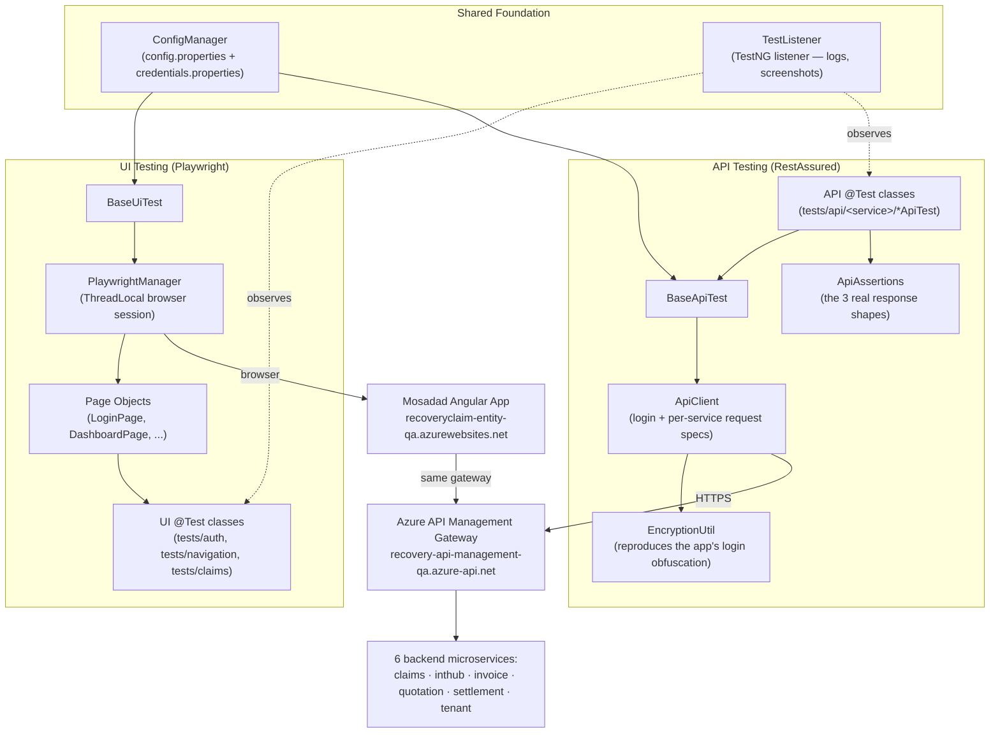
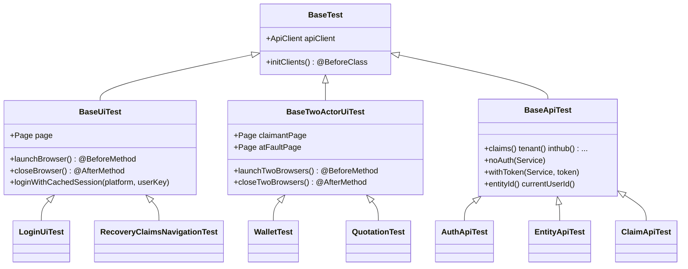
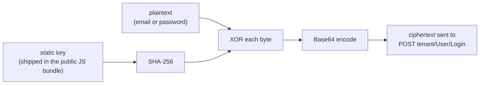
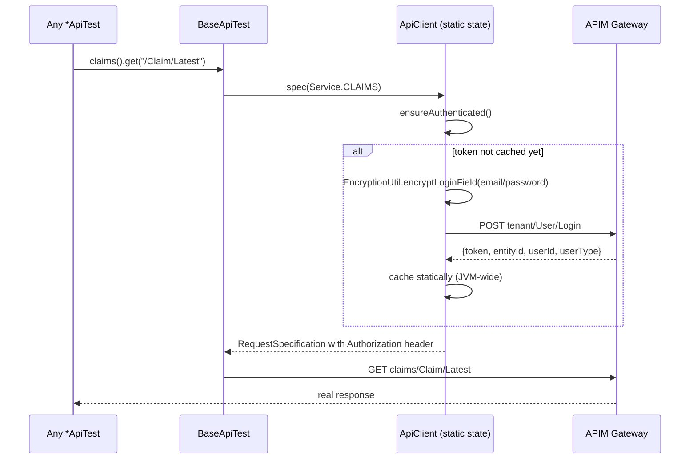
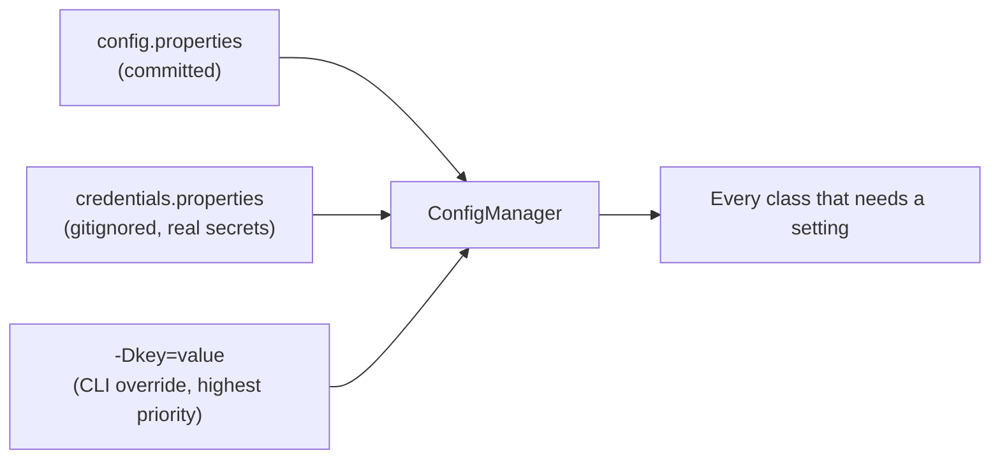
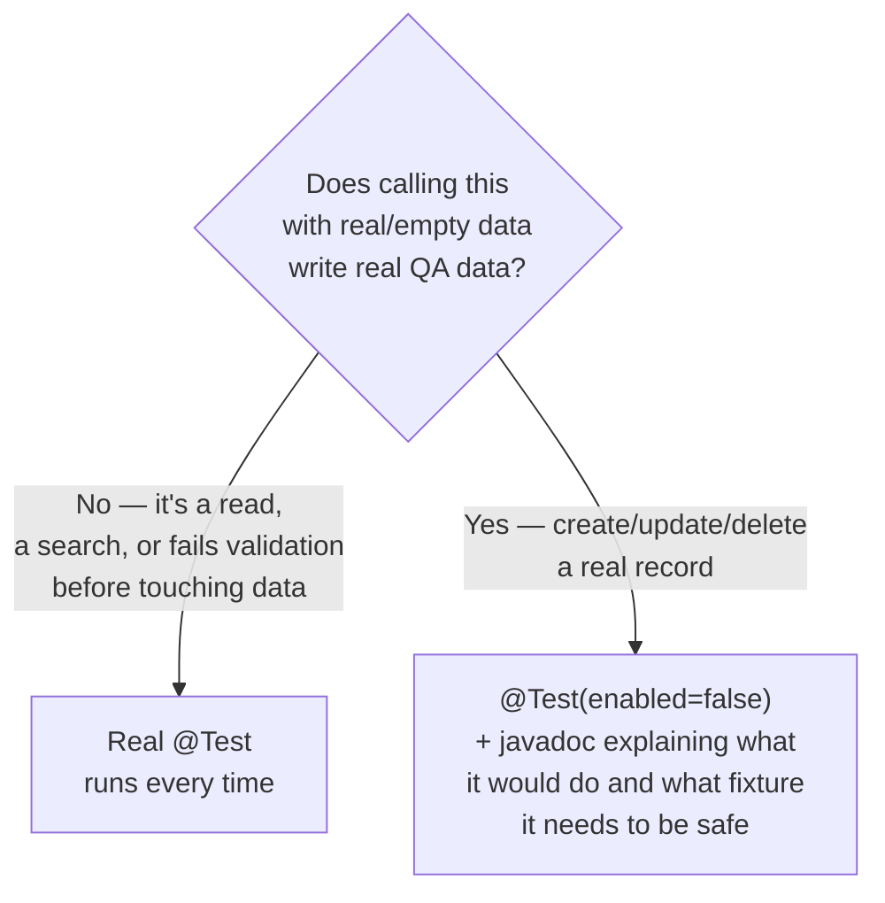

# Mosadad Testing Framework — Design Guide

This document explains **how the framework is put together** — the layers,
the packages, and the path a request takes from a `@Test` method to a real
HTTP call and back. It's the "how it works" companion to:

- **`MOSADAD_DOMAIN.md`** — what the app under test *does* (claim lifecycle, actors, SLAs)
- **`FRAMEWORK.md`** — *why* each technology/pattern was chosen, and the full verified-vs-stubbed ledger

Read this one first if you're new to the codebase and want the mental model
before diving into any single class.

---

## 1. The big picture

Two independent test surfaces share one foundation:



**The one fact that explains most design decisions below:** the UI and the
API talk to the *same backend*. The Angular app is just another API
consumer. That's what made it possible to reverse-engineer the app's own
login call and drive the real backend directly, without a browser — see
§4.

---

## 2. Package map

```
com.mosadad.testing
│
├── api/                    ← REAL backend clients (main/, so both UI and API tests can use them)
│   ├── ApiClient            One client, all 6 services, cached login
│   ├── ApiAssertions        Shared assertion helpers for the 3 response shapes
│   ├── EncryptionUtil       Login field obfuscation (XOR + SHA-256)
│   └── WalletApiClient      A *different* third-party system (ATB Pay) — not Mosadad's own backend
│
├── browser/                ← Playwright session management
│   ├── PlaywrightManager     ThreadLocal<Playwright/Browser/Context/Page>
│   ├── AuthStateCache        JVM-wide cached login (storageState) — real login once per user, not once per @Test
│   ├── TwoActorPlaywrightManager   Two simultaneous logged-in sessions (cross-role flows)
│   └── ActorPages            Bundles a role's Page Objects together
│
├── config/
│   └── ConfigManager         Central settings reader — see §6
│
├── constants/
│   ├── Routes                 Verified front-end URL paths
│   └── TestDataConstants      Roles, SLA hours, claim methods
│
├── listeners/
│   └── TestListener           TestNG hook — logs pass/fail, screenshots UI failures
│
├── pages/                  ← Page Objects (UI layer only)
│   ├── BasePage                fill/click/getText/isVisible/waitVisible
│   ├── LoginPage, DashboardPage, ...
│   └── claims/                 Per-claim-stage page objects
│
└── utils/
    ├── ExcelUtils, RandomUniqueGenerator, ScreenshotUtils, CommonMethods
```

```
test/java/com.mosadad.testing
│
├── base/                   ← The test-class hierarchy — see §3
│   ├── BaseTest              Initialises apiClient (every test gets one)
│   ├── BaseUiTest             extends BaseTest, one Playwright session per test
│   ├── BaseTwoActorUiTest     extends BaseTest, two concurrent sessions (claimant + at-fault)
│   └── BaseApiTest            extends BaseTest, adds per-service spec shortcuts
│
└── tests/
    ├── auth/, navigation/, utils/   ← single-actor UI tests
    ├── claims/                      ← two-actor UI tests + ClaimLifecycleFixtures
    │                                  (shared setup for Quotation/Invoice/SettlementTest — see §7)
    │
    └── api/                                         ← API tests — see §5
        ├── AuthApiTest                                 cross-cutting login/security tests
        ├── tenant/     (10 classes)
        ├── inthub/     (5 classes)
        ├── quotation/  (3 classes)
        ├── settlement/ (4 classes)
        ├── invoice/    (4 classes)
        └── claims/     (20 classes)
```

**Why `api/` lives under `main/`, not `test/`:** `ApiClient` isn't
test-only scaffolding — it's a reusable backend client, the same way
`PlaywrightManager` is a reusable browser client. Both `BaseUiTest` and
`BaseApiTest` end up depending on it (a UI test can call the API to set up
data; today nothing does, but the seam is there).

---

## 3. The base-class hierarchy



Every test class ultimately extends `BaseTest`, which is why every test —
UI or API — has `apiClient` available. `BaseUiTest` layers on one
Playwright browser session; `BaseTwoActorUiTest` is the sibling for tests
needing two concurrently-logged-in sessions (claimant + at-fault — one
insurer submits, the other receives/acts); `BaseApiTest` layers on short,
readable accessors so test bodies read like `claims().get("/Claim/Latest/" + entityId())` instead of
spelling out the request spec every time.

This mirrors the sibling `ShopTestApp-Java-Mobile-Testing` framework's
`DriverManager` pattern — same shape, different transport.

---

## 4. How an API test actually runs

This is the part worth understanding in detail, because it's the least
obvious piece: **the suite logs into the real backend without a browser.**

### 4.1 The problem

The Angular app's login form doesn't send `{"email":"you@x.com"}` — it
sends `{"email":"3JuzJkGwiI7eL2P7TL8kUhU="}`. Sending the plaintext version
straight to the API returns a `500`. The obfuscation logic lives in the
app's own minified JS bundle.

### 4.2 The fix — `EncryptionUtil`

Reverse-engineered from the live bundle and reproduced exactly in Java:



Verified byte-for-byte against a real captured login request before being
trusted. This isn't defeating any real security control — it's exactly
what the legitimate client already does on every login; the test suite
just does it without a browser.

### 4.3 The login + caching flow



The login only happens **once per JVM run**, no matter how many of the 46
test classes execute — `cachedAccessToken` is a `static volatile` field on
`ApiClient`, guarded by a double-checked lock in `ensureAuthenticated()`.
Every test class calls `initClients()` and gets a fresh `ApiClient`
*instance*, but they all share the same cached session. That's why a full
`mvn test -P api` run (330 tests) does exactly one real login call, not
330.

### 4.4 Request builders on `ApiClient`

| Method | Use |
|---|---|
| `spec(Service)` | Normal authenticated call |
| `noAuth(Service)` (via `BaseApiTest`) | "Missing token → 401" tests |
| `specWithToken(Service, token)` | "Malformed/expired token" tests |
| `multipartSpec(Service)` | File uploads |

`Service` is an enum (`CLAIMS`, `INTHUB`, `INVOICE`, `QUOTATION`,
`SETTLEMENT`, `TENANT`) whose only job is mapping to a path segment on the
shared gateway — `GATEWAY + "/" + segment`.

---

## 5. The three response shapes — and why `ApiAssertions` exists

The backend doesn't return errors one consistent way. Getting this wrong
is the single easiest way to write a flaky or wrong assertion, so it's
centralized in one place instead of re-discovered per test:

| Shape | When | Example |
|---|---|---|
| **Envelope success** | Normal happy path | HTTP 200, body `{statusCode:200, isSuccess:true, response:{...}}` |
| **Envelope failure** | A *business* failure on an otherwise well-formed request (wrong password, "not found", permission denied at the business layer) | **Still HTTP 200**, body `{statusCode:400, isSuccess:false, message:"..."}` |
| **Model-validation failure** | A required field is missing before the controller even runs | Real **HTTP 400**, RFC-9110 ProblemDetails body: `{errors:{Field:[...]}, title, status}` |
| **Transport failure** | No/invalid bearer token, unroutable path | Real **HTTP 401 / 404** |

`ApiAssertions` gives each shape its own helper —
`assertEnvelopeSuccess`, `assertEnvelopeFailure(expectedInnerCode)`,
`assertValidationProblem(...expectedFields)`, `assertHttpUnauthorized` —
so a test's intent is legible from the assertion name, not from re-deriving
which layer just responded.

---

## 6. Configuration flow



`ConfigManager.get(key)` always checks `System.getProperty(key)` first —
so CI can override anything (`-Dqa.claimant.email=...`) without touching a
file, which is the intended path for secrets in CI. Locally,
`credentials.properties` (copied from the committed `.example` template)
holds the real QA logins.

The API layer's addition: `api.gateway.url.qa` — the real APIM gateway URL
`ApiClient` uses for every service call.

---

## 7. Test-class organization (the API layer's convention)

**One class per Swagger tag, per service.** A tag in Swagger already
groups related endpoints (`Claim`, `FastTrack`, `Dashboard`, ...) — the
suite mirrors that grouping one-to-one, so if you're reading the Swagger
UI for `claims/FastTrack`, `FastTrackApiTest.java` is where its tests live.
No guessing.

**Every test method maps to a specific documented operation.** Method
names describe the scenario, not just the endpoint:

```
getEntityByIdForOwnEntityReturns200
getEntityByIdWithNonExistentIdReturnsEnvelopeFailure
createEntityWithEmptyBodyReturnsValidationError      ← live, safe (validates, doesn't create)
createEntityWithValidPayloadReturns200               ← enabled=false (STUB, see below)
```

**Live vs. stub is a deliberate, visible split**, not laziness:



This is the same discipline the UI layer already used before this API work
started (`CreateManualRecoveryClaimTest` etc. were already "real test,
disabled until verified" — see `FRAMEWORK.md`). The API layer just applies
it at much larger scale: 338 live, 73 stubs.

**A sharper rule inside that: some endpoints have no safe way to probe at
all.** A handful take no id and mutate on an empty body with zero
validation (`Quotation/AcceptAll` and its siblings — full list in
`FRAMEWORK.md`). Those don't even get a live validation-only test; they're
`enabled=false` with a loud warning and nothing else.

---

## 8. Everyday commands

```bash
mvn test -P api          # API suite only — no browser, ~2 min, 411 tests
mvn test -P ui            # UI suite only
mvn test -P smoke         # Fastest gate — one login test
mvn test                  # Full regression (default profile) — UI + API

# HTML dashboard for whichever run just happened (pass/fail/skip counts,
# drill into any test's full error/stack trace) — full detail, including
# why the short "mvn allure:serve" form doesn't work here, in FRAMEWORK.md's
# "Reports & Logs" section:
mvn io.qameta.allure:allure-maven:2.15.1:serve
```

`-DsuiteXmlFile=path/to/custom.xml` overrides which TestNG suite file runs,
if you ever want to point Surefire at something other than the four
profiles above (useful for running a single package while iterating).

---

## 9. Extending the framework

**Adding a test for an endpoint that already has a test class for its
tag:** add a `@Test` method to that class. Follow the naming pattern
(`<action><scenario>Returns<outcome>`), pick the right `ApiAssertions`
helper for the response shape you actually observed (don't assume —
curl it first), and default to a live test unless it would write real
data.

**Adding a whole new tag/class:** create `tests/api/<service>/<Tag>ApiTest.java`
extending `BaseApiTest`, add it under the matching `<package>` block in
`testng-api.xml` (packages are auto-discovered, so a new class in an
existing package needs no XML change at all).

**Adding a new service:** add an entry to `ApiClient.Service`, a
`gateway.url.<env>` config key if it's a different gateway, and a new
`<test>` block in the suite XMLs.

---

## 10. Where the rest of the detail lives

This document is the map. For the territory:

- **`FRAMEWORK.md`** — full verified-vs-stubbed ledger, the known
  unscoped bulk-action endpoints to never call ad hoc, every backend bug
  found while building this suite, and the **Reports & Logs** section
  (how to generate/read the Allure HTML dashboard, and where plain-text
  per-test error logs live on disk).
- **`MOSADAD_DOMAIN.md`** — the business domain (claim lifecycle, SLAs,
  disputes, wallet) that the test names and fixtures are written against.
- Class-level javadoc on `ApiClient`, `ApiAssertions`, and
  `EncryptionUtil` — the "why" behind each, with citations to what was
  confirmed live and when.
