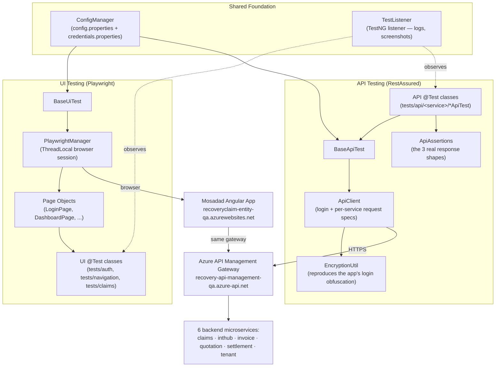
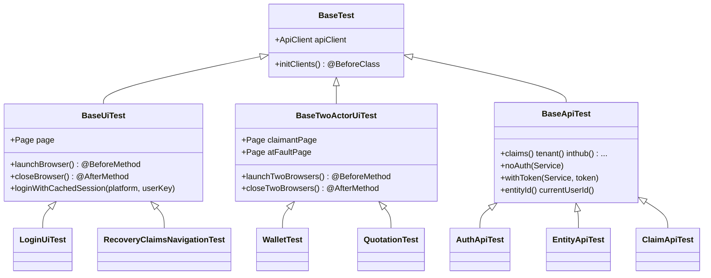
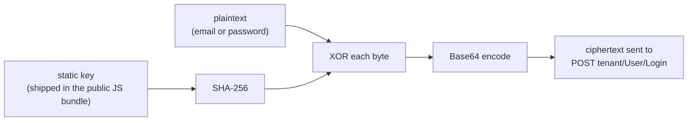
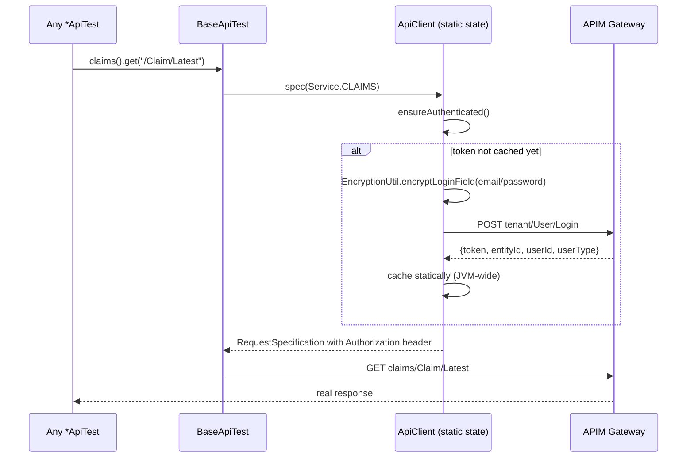
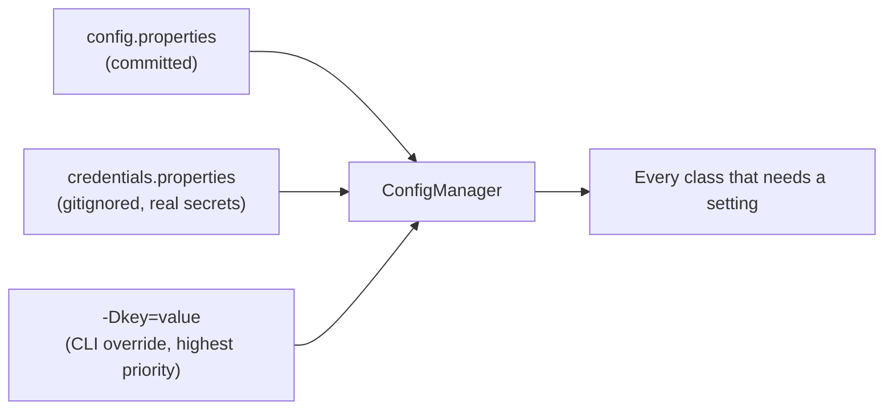
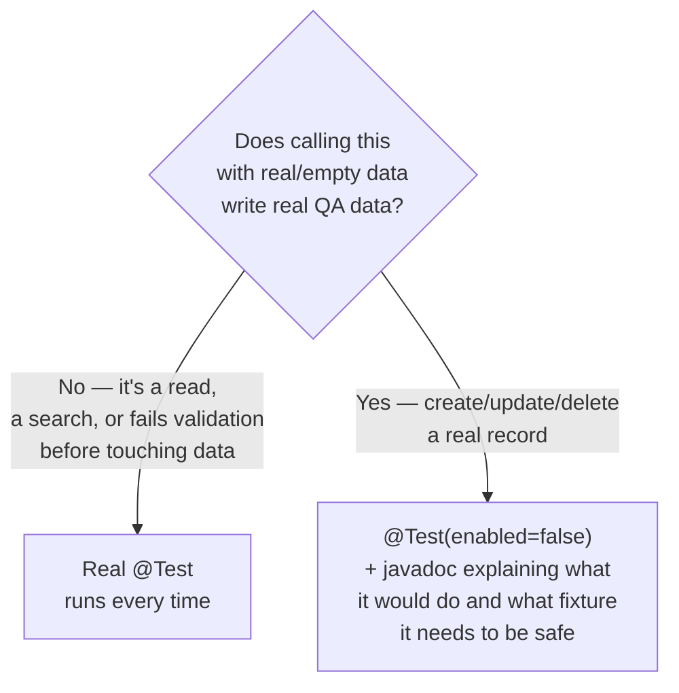

# Mosadad Testing Framework — Reference

This is the combined reference for the framework: **what the app does**
(business domain), **how the suite is built** (design/architecture), and
**why each choice was made, plus what's actually verified vs. stubbed**
(framework decisions and the trust ledger). It used to be three separate
files (`MOSADAD_DOMAIN.md`, `DESIGN.md`, `FRAMEWORK.md`) — they're merged
here as sections so there's one place to read, top to bottom, instead of
three.

- **Part 1 — Business Domain** — what the app under test *does*: actors,
  claim lifecycle, SLAs, disputes, wallet.
- **Part 2 — Design & Architecture** — the layers, the package map, and the
  path a request takes from a `@Test` method to a real HTTP call and back.
- **Part 3 — Framework Decisions & Verified/Stubbed Ledger** — why each
  technology/pattern was chosen, and the full honest accounting of what's
  live-verified vs. still a stub.
- **Part 4 — Project Structure, Running Tests, Reports & Next Steps.**

If a test's intent is unclear, Part 1 is the source of truth for domain
behavior; if the app's real behavior ever contradicts it, the document is
out of date — update it as part of that change.

**App under test:** UAE-based Insurance Recovery platform.
**QA URL:** `https://recoveryclaim-entity-qa.azurewebsites.net/auth/login`

---

# Part 1 — Business Domain

## Actors

| Role | Purpose |
|---|---|
| **Claimant Insurer** | The insurer asking to be reimbursed. Creates and drives recovery claims. |
| **At-Fault Insurer** | The insurer responsible for paying. Responds to claims, quotations, invoices. |
| **Regulator** | Monitors disputes, response times, and settlement patterns across the market. |
| **Mosadad Admin** | Manages system access and governance. |

There are **38 insurers** registered in the UAE using the platform.

Only a **Claimant Insurer** test account exists in this framework today
(`Dubaiqa@gmail.com`, verified live — lands on `/entity-landing/dashboard`
with the "Entity Modules" sidebar: Home, Recovery Claims, Company Details).
At-Fault Insurer, Regulator, and Mosadad Admin accounts are not yet
provisioned; any test requiring a cross-role interaction is a stub until
those credentials are available.

## Claim Lifecycle

A recovery claim moves through four sequential stages. Every stage after
Stage 1 depends on the At-Fault insurer responding within an SLA window.

### Stage 1 — Claim Registration

The Claimant Insurer creates a recovery claim, entering:

- Claim number
- Policy details
- Vehicle details
- Accident details
- Official Police Report reference number
- Supporting documents

**Hard rule:** recovery is based on the official Police Report. Without a
valid accident report reference, recovery cannot proceed.

Three ways to create a claim:

1. **Manual Entry** — insurer types information directly.
2. **Police Data Entry** — accident details entered based on the official
   Police Report issued by Dubai Police, Rafid, Saeed, or another UAE
   Police authority.
3. **Fast Track (Bulk Excel Upload)** — for uploading many claims at once.

On submission, the **At-Fault insurer is automatically notified**.

### Stage 2 — Quotation

Repair cost is submitted here. Two mutually exclusive paths:

#### A. Normal Repair

1. Claimant uploads: workshop estimate, repair amount, supporting documents.
2. System sends a notification and starts a **72-hour timer**.
3. At-Fault insurer must respond within **3 working days**: Approve or
   Negotiate.
4. Negotiation happens inside the system until both sides agree.
5. Once agreed, the system generates an **Approval Letter**.

#### B. Total Loss

Triggered when vehicle damage is severe and repair is not economical.

1. Claimant submits: sum insured, total loss amount, supporting documents.
2. System sends a notification and starts a **7-day timer (168 hours)**.
3. If approved, the **Salvage** stage begins — selling the damaged vehicle
   for scrap value:
   - Claimant enters salvage buyer details and salvage amount.
   - System automatically adds **5% VAT** and updates the total claim
     amount.
4. Once salvage is approved, the claimant uploads the invoice and Stage 3
   begins.

### Stage 3 — Invoice

1. Claimant uploads: final repair invoice number, credit note paid to
   workshop, supporting documents.
2. System generates a recovery letter and notifies the At-Fault insurer.
3. At-Fault insurer Approves or Negotiates the invoice.
4. Once approved, the Settlement stage begins.

### Stage 4 — Settlement

1. At-Fault insurer enters the credit note number and uploads the credit
   note copy.
2. Once done, claim status becomes **Closed**. Recovery is complete.

## Fast Track — Why It Exists

Insurers may hold 50, 100, or 200+ small recovery claims against the same
counterpart insurer; creating each one manually is slow. Fast Track offers:

- Bulk upload using Excel
- Automatic validation of required columns
- Duplicate claim detection
- Batch processing

The At-Fault insurer can download the same file, enter credit note numbers,
and upload the updated sheet. Fast Track targets **high-volume, simple
recoveries**, trading per-claim detail for throughput.

## Disputes

If insurers disagree on **liability**, **repair amount**, or **invoice**, a
structured dispute is raised inside Mosadad instead of over email:

1. Claimant raises a dispute.
2. At-Fault insurer responds.
3. All communication is logged.
4. Timestamps are recorded.
5. **Undisputed amounts can still move forward** — a dispute on one line
   item doesn't block the rest of the claim.

If unresolved, the **Regulator** can see the full dispute history. This is
the transparency/accountability mechanism replacing informal email
back-and-forth.

## SLA Timers

| Quotation type | SLA window |
|---|---|
| Normal Repair | 72 hours |
| Total Loss | 168 hours (7 days) |

Purpose: faster resolution, no silent delays, a fair and trackable process.
**Missed deadlines are recorded** — this is what feeds the Regulator's
"SLA Violation" view (a real screen, confirmed live at
`/entity-portal/sla-violation`).

## Wallet, Settlement Rail & UAE PASS

### Mosadad Wallet

Each insurer maintains, per the platform's digital wallet:

- Payable position
- Receivable position
- Settled amounts
- Outstanding amounts

The wallet does **not** replace a bank transfer — it records and structures
settlement confirmation digitally, giving clear reconciliation, no
paid/unpaid confusion, transparent financial exposure, and Regulator
visibility into settlement behavior. (A "My Wallets" entry point was
confirmed live on the entity dashboard.)

### Digital Settlement Flow

1. Claim approved
2. Invoice approved
3. At-Fault insurer issues credit note
4. Settlement recorded in Mosadad
5. Wallet updated
6. Claim marked **Closed**

This is the structured financial settlement rail between insurers that
Stage 4 (Settlement) implements.

### UAE PASS

UAE PASS is the UAE's official digital identity system, providing secure
login, identity verification, and legal digital authentication. Mosadad
uses it because recovery claims carry financial and legal responsibility,
so access must be secure and verified. **Not yet exercised by this
framework** — the QA login used here is plain email/password, not a UAE
PASS flow; if the app supports both, note which path a given test exercises.

---

# Part 2 — Design & Architecture

## 2.1 The big picture

Two independent test surfaces share one foundation:



**The one fact that explains most design decisions below:** the UI and the
API talk to the *same backend*. The Angular app is just another API
consumer. That's what made it possible to reverse-engineer the app's own
login call and drive the real backend directly, without a browser — see
§2.4.

## 2.2 Package map

```
com.mosadad.testing
│
├── api/                    ← REAL backend clients (main/, so both UI and API tests can use them)
│   ├── ApiClient            One client, all 6 services, cached login
│   ├── ApiAssertions        Shared assertion helpers for the 3 response shapes
│   ├── EncryptionUtil       Login field obfuscation (XOR + SHA-256)
│   └── WalletApiClient      A *different* third-party system (ATB Pay) — not Mosadad's own backend
│
├── browser/                ← Playwright session management
│   ├── PlaywrightManager     ThreadLocal<Playwright/Browser/Context/Page>
│   ├── AuthStateCache        JVM-wide cached login (storageState) — real login once per user, not once per @Test
│   ├── TwoActorPlaywrightManager   Two simultaneous logged-in sessions (cross-role flows)
│   └── ActorPages            Bundles a role's Page Objects together
│
├── config/
│   └── ConfigManager         Central settings reader — see §2.6
│
├── constants/
│   ├── Routes                 Verified front-end URL paths
│   └── TestDataConstants      Roles, SLA hours, claim methods
│
├── listeners/
│   └── TestListener           TestNG hook — logs pass/fail, screenshots UI failures
│
├── pages/                  ← Page Objects (UI layer only)
│   ├── BasePage                fill/click/getText/isVisible/waitVisible
│   ├── LoginPage, DashboardPage, ...
│   └── claims/                 Per-claim-stage page objects
│
└── utils/
    ├── ExcelUtils, RandomUniqueGenerator, ScreenshotUtils, CommonMethods
```

```
test/java/com.mosadad.testing
│
├── base/                   ← The test-class hierarchy — see §2.3
│   ├── BaseTest              Initialises apiClient (every test gets one)
│   ├── BaseUiTest             extends BaseTest, one Playwright session per test
│   ├── BaseTwoActorUiTest     extends BaseTest, two concurrent sessions (claimant + at-fault)
│   └── BaseApiTest            extends BaseTest, adds per-service spec shortcuts
│
└── tests/
    ├── auth/, navigation/, utils/   ← single-actor UI tests
    ├── claims/                      ← two-actor UI tests + ClaimLifecycleFixtures
    │                                  (shared setup for Quotation/Invoice/SettlementTest — see §2.7)
    │
    └── api/                                         ← API tests — see §2.5
        ├── AuthApiTest                                 cross-cutting login/security tests
        ├── tenant/     (10 classes)
        ├── inthub/     (5 classes)
        ├── quotation/  (3 classes)
        ├── settlement/ (4 classes)
        ├── invoice/    (4 classes)
        └── claims/     (20 classes)
```

**Why `api/` lives under `main/`, not `test/`:** `ApiClient` isn't
test-only scaffolding — it's a reusable backend client, the same way
`PlaywrightManager` is a reusable browser client. Both `BaseUiTest` and
`BaseApiTest` end up depending on it (a UI test can call the API to set up
data; today nothing does, but the seam is there).

## 2.3 The base-class hierarchy



Every test class ultimately extends `BaseTest`, which is why every test —
UI or API — has `apiClient` available. `BaseUiTest` layers on one
Playwright browser session; `BaseTwoActorUiTest` is the sibling for tests
needing two concurrently-logged-in sessions (claimant + at-fault — one
insurer submits, the other receives/acts); `BaseApiTest` layers on short,
readable accessors so test bodies read like `claims().get("/Claim/Latest/" + entityId())` instead of
spelling out the request spec every time.

This mirrors the sibling `ShopTestApp-Java-Mobile-Testing` framework's
`DriverManager` pattern — same shape, different transport.

See §3.5 below (Design Pattern — Two-Layer Base Class Hierarchy) for which
concrete test classes are real vs. stubbed.

## 2.4 How an API test actually runs

This is the part worth understanding in detail, because it's the least
obvious piece: **the suite logs into the real backend without a browser.**

### 2.4.1 The problem

The Angular app's login form doesn't send `{"email":"you@x.com"}` — it
sends `{"email":"3JuzJkGwiI7eL2P7TL8kUhU="}`. Sending the plaintext version
straight to the API returns a `500`. The obfuscation logic lives in the
app's own minified JS bundle.

### 2.4.2 The fix — `EncryptionUtil`

Reverse-engineered from the live bundle and reproduced exactly in Java:



Verified byte-for-byte against a real captured login request before being
trusted. This isn't defeating any real security control — it's exactly
what the legitimate client already does on every login; the test suite
just does it without a browser.

### 2.4.3 The login + caching flow



The login only happens **once per JVM run**, no matter how many of the 46
test classes execute — `cachedAccessToken` is a `static volatile` field on
`ApiClient`, guarded by a double-checked lock in `ensureAuthenticated()`.
Every test class calls `initClients()` and gets a fresh `ApiClient`
*instance*, but they all share the same cached session. That's why a full
`mvn test -P api` run (330 tests) does exactly one real login call, not
330.

### 2.4.4 Request builders on `ApiClient`

| Method | Use |
|---|---|
| `spec(Service)` | Normal authenticated call |
| `noAuth(Service)` (via `BaseApiTest`) | "Missing token → 401" tests |
| `specWithToken(Service, token)` | "Malformed/expired token" tests |
| `multipartSpec(Service)` | File uploads |

`Service` is an enum (`CLAIMS`, `INTHUB`, `INVOICE`, `QUOTATION`,
`SETTLEMENT`, `TENANT`) whose only job is mapping to a path segment on the
shared gateway — `GATEWAY + "/" + segment`.

## 2.5 The three response shapes — and why `ApiAssertions` exists

The backend doesn't return errors one consistent way. Getting this wrong
is the single easiest way to write a flaky or wrong assertion, so it's
centralized in one place instead of re-discovered per test:

| Shape | When | Example |
|---|---|---|
| **Envelope success** | Normal happy path | HTTP 200, body `{statusCode:200, isSuccess:true, response:{...}}` |
| **Envelope failure** | A *business* failure on an otherwise well-formed request (wrong password, "not found", permission denied at the business layer) | **Still HTTP 200**, body `{statusCode:400, isSuccess:false, message:"..."}` |
| **Model-validation failure** | A required field is missing before the controller even runs | Real **HTTP 400**, RFC-9110 ProblemDetails body: `{errors:{Field:[...]}, title, status}` |
| **Transport failure** | No/invalid bearer token, unroutable path | Real **HTTP 401 / 404** |

`ApiAssertions` gives each shape its own helper —
`assertEnvelopeSuccess`, `assertEnvelopeFailure(expectedInnerCode)`,
`assertValidationProblem(...expectedFields)`, `assertHttpUnauthorized` —
so a test's intent is legible from the assertion name, not from re-deriving
which layer just responded.

## 2.6 Configuration flow



`ConfigManager.get(key)` always checks `System.getProperty(key)` first —
so CI can override anything (`-Dqa.claimant.email=...`) without touching a
file, which is the intended path for secrets in CI. Locally,
`credentials.properties` (copied from the committed `.example` template)
holds the real QA logins.

The API layer's addition: `api.gateway.url.qa` — the real APIM gateway URL
`ApiClient` uses for every service call.

## 2.7 Test-class organization (the API layer's convention)

**One class per Swagger tag, per service.** A tag in Swagger already
groups related endpoints (`Claim`, `FastTrack`, `Dashboard`, ...) — the
suite mirrors that grouping one-to-one, so if you're reading the Swagger
UI for `claims/FastTrack`, `FastTrackApiTest.java` is where its tests live.
No guessing.

**Every test method maps to a specific documented operation.** Method
names describe the scenario, not just the endpoint:

```
getEntityByIdForOwnEntityReturns200
getEntityByIdWithNonExistentIdReturnsEnvelopeFailure
createEntityWithEmptyBodyReturnsValidationError      ← live, safe (validates, doesn't create)
createEntityWithValidPayloadReturns200               ← enabled=false (STUB, see below)
```

**Live vs. stub is a deliberate, visible split**, not laziness:



This is the same discipline the UI layer already used before this API work
started (`CreateManualRecoveryClaimTest` etc. were already "real test,
disabled until verified" — see Part 3 below). The API layer just applies
it at much larger scale: 338 live, 73 stubs.

**A sharper rule inside that: some endpoints have no safe way to probe at
all.** A handful take no id and mutate on an empty body with zero
validation (`Quotation/AcceptAll` and its siblings — full list in §3.7
below). Those don't even get a live validation-only test; they're
`enabled=false` with a loud warning and nothing else.

## 2.8 Everyday commands

```bash
mvn test -P api          # API suite only — no browser, ~2 min, 411 tests
mvn test -P ui            # UI suite only
mvn test -P smoke         # Fastest gate — one login test
mvn test                  # Full regression (default profile) — UI + API

# HTML dashboard for whichever run just happened (pass/fail/skip counts,
# drill into any test's full error/stack trace) — full detail, including
# why the short "mvn allure:serve" form doesn't work here, in §4.8's
# "Reports & Logs" section:
mvn io.qameta.allure:allure-maven:2.15.1:serve
```

`-DsuiteXmlFile=path/to/custom.xml` overrides which TestNG suite file runs,
if you ever want to point Surefire at something other than the four
profiles above (useful for running a single package while iterating).

## 2.9 Extending the framework

**Adding a test for an endpoint that already has a test class for its
tag:** add a `@Test` method to that class. Follow the naming pattern
(`<action><scenario>Returns<outcome>`), pick the right `ApiAssertions`
helper for the response shape you actually observed (don't assume —
curl it first), and default to a live test unless it would write real
data.

**Adding a whole new tag/class:** create `tests/api/<service>/<Tag>ApiTest.java`
extending `BaseApiTest`, add it under the matching `<package>` block in
`testng-api.xml` (packages are auto-discovered, so a new class in an
existing package needs no XML change at all).

**Adding a new service:** add an entry to `ApiClient.Service`, a
`gateway.url.<env>` config key if it's a different gateway, and a new
`<test>` block in the suite XMLs.

Class-level javadoc on `ApiClient`, `ApiAssertions`, and `EncryptionUtil`
carries the "why" behind each, with citations to what was confirmed live
and when — treat it as a third source alongside this document and the
domain reference in Part 1.

---

# Part 3 — Framework Decisions & Verified/Stubbed Ledger

## 3.1 Why this framework exists

A combined UI (Playwright) + API (RestAssured) test automation framework for
the Mosadad Recovery Claim insurance platform, built to the same standard as
the sibling frameworks in this workspace (`ShopTestApp-Java-Mobile-Testing`,
`ShopTestApp-Playwright`) — the pattern used at large-scale Java QA shops
(Uber, Microsoft, Swiggy, Zomato, OLA, Flipkart).

See Part 1 above for what the app under test actually does.

## 3.2 Technology Stack

| Layer | Choice | Version |
|---|---|---|
| Language | Java | 17 (LTS) |
| Build | Maven | 3.x |
| Test Runner | TestNG | 7.10.2 |
| UI Automation | Playwright (Java) | 1.60.0 |
| API Testing | RestAssured | 5.5.0 |
| Reporting | Allure | 2.29.0 |
| JSON | Jackson | 2.18.2 |
| Assertions | AssertJ | 3.26.3 |
| Boilerplate | Lombok | 1.18.36 |
| Logging | Log4j2 | 2.24.3 |

These are the exact same choices and versions as
`ShopTestApp-Java-Mobile-Testing`, swapping Appium (mobile) for Playwright
(web) — see that project's `FRAMEWORK.md` for the full reasoning behind
TestNG-over-JUnit5, Maven-over-Gradle, RestAssured, Allure, AssertJ, and
Log4j2. Only the UI-automation and locator-strategy decisions differ enough
to repeat here.

## 3.3 Decision — Playwright over Selenium

The user asked for "a Selenium framework having both UI (Playwright) and API
testing" — read as: build to Selenium-framework standards (POM, TestNG,
Maven, Page-Object base classes, ThreadLocal session management) but use
Playwright as the actual browser-automation engine, which is what the
sibling `ShopTestApp-Playwright` project already establishes as this
workspace's convention for web (as opposed to mobile/Appium) UI testing.

Playwright over raw Selenium WebDriver:

- **Auto-waiting is built in.** Every `Locator` action (click, fill, etc.)
  waits for the element to be actionable before acting — the exact problem
  Selenium needs explicit `WebDriverWait` boilerplate for.
- **Locators are lazy by construction.** `page.locator(selector)` doesn't
  resolve anything until an action is called on it, so there's no
  Page-Factory staleness problem to design around (the sibling Appium
  framework had to explicitly avoid `@FindBy` for this reason — Playwright
  gets it for free).
- **Built-in tracing** (`context.tracing()`) captures a full timeline —
  screenshots, DOM snapshots, and source links — for every test, which is
  invaluable when a QA/UAT environment's real DOM structure isn't fully
  mapped yet (see "What's stubbed" below).
- Same reasoning as `ShopTestApp-Playwright`'s existing choice, just
  restructured into the cleaner `com.mosadad.testing` package convention
  established in `ShopTestApp-Java-Mobile-Testing`.

## 3.4 Decision — ThreadLocal PlaywrightManager

```java
private static final ThreadLocal<Page> PAGE = new ThreadLocal<>();
```

Same reasoning as the sibling framework's `DriverManager` for Appium:
parallel TestNG execution (`parallel="tests"`/`"methods"`) needs one
independent Playwright session per thread, or one test's navigation leaks
into another's assertions. `PlaywrightManager` holds `Playwright`,
`Browser`, `BrowserContext`, and `Page` all as separate `ThreadLocal`s and
tears all four down together in `close()`.

## 3.5 Decision — Cached login via Playwright storageState

`RecoveryClaimsNavigationTest` used to log in through the real UI form in
its own `@BeforeMethod` — once per `@Test` method, 8 real logins per suite
run just to get to the screen actually under test. `AuthStateCache` fixes
this the same way `ApiClient` already caches its access token: log in for
real exactly once per platform+user per JVM run (double-checked locking),
capture the authenticated `BrowserContext`'s `storageState()` (cookies +
localStorage — wherever the app's session actually lives, storageState
captures both), and cache that JSON string in memory for the rest of the
run. Every later test that needs to already be logged in calls
`BaseUiTest.loginWithCachedSession(platform, userKey)`, which reopens its
already-launched browser's context seeded with that cached state
(`PlaywrightManager.reopenWithStorageState()`) instead of a blank one —
still a fresh, isolated context per test method, just pre-authenticated.

Deliberately **not** persisted to disk across separate `mvn test` runs —
only kept in memory for the one JVM run — so a stale/expired token from a
previous run can never leak into a later one. `LoginUiTest`, which tests
the login form itself, doesn't use this at all and keeps driving
`LoginPage` for real.

## 3.6 Decision — Page Objects without Page Factory, using plain selector strings

Locators are stored as `private static final String` constants (CSS/text
selectors), resolved via `page.locator(selector)` inside `BasePage` helper
methods (`fill`, `click`, `getText`, `isVisible`, `waitVisible`). No
`@FindBy`-equivalent annotation layer — Playwright's `Locator` already does
lazy, auto-waited resolution, so a Page-Factory-style abstraction would add
nothing over calling `page.locator()` directly.

## 3.7 Design Pattern — Two-Layer Base Class Hierarchy

```
BaseTest                  (apiClient)
  ├── BaseUiTest            (extends BaseTest + one Playwright session lifecycle)
  │     ├── LoginUiTest                    — REAL, verified
  │     └── RecoveryClaimsNavigationTest   — REAL, verified
  │
  ├── BaseTwoActorUiTest     (extends BaseTest + two concurrent Playwright sessions — claimant + at-fault)
  │     ├── WalletTest                     — REAL, verified
  │     ├── CreateManualRecoveryClaimTest  — real flow, stub (enabled=false, uses the old pre-2026-09-07 gate screen — see ClaimLifecycleFixtures' Javadoc)
  │     ├── QuotationTest                  — one real method recovered (stub, enabled=false); rest still stub
  │     ├── InvoiceTest                    — one real method recovered (stub, enabled=false); rest still stub
  │     ├── SettlementTest                 — one real method recovered (stub, enabled=false — ends in a real ATB Pay payment, see its class Javadoc before enabling); rest still stub
  │     └── DisputeTest                    — stub
  │
  └── BaseApiTest            (extends BaseTest — API only, no browser)
        ├── AuthApiTest                    — REAL, verified (tenant/User/Login)
        ├── tests/api/tenant/*Test         — REAL, verified (10 classes)
        ├── tests/api/inthub/*Test         — REAL, verified (5 classes)
        ├── tests/api/quotation/*Test      — REAL, verified (3 classes)
        ├── tests/api/settlement/*Test     — REAL, verified (4 classes)
        ├── tests/api/invoice/*Test        — REAL, verified (4 classes)
        └── tests/api/claims/*Test         — REAL, verified (20 classes)
```

`QuotationTest`, `InvoiceTest`, and `SettlementTest`'s real methods share their
setup through `tests/claims/ClaimLifecycleFixtures` (package-private, not a
`@Test` class itself) — each stage's fixture method takes the previous
stage's result and returns its own, since Stage 2 needs an accepted claim,
Stage 3 needs an accepted quotation, and Stage 4 needs an accepted invoice.
See that class's Javadoc for the full provenance: it was recovered from an
original one-method, six-stage two-actor E2E draft and split to match how
the rest of this suite is organized, one stage per class.

API-only tests run without a browser at all (`mvn test -P api`), same role
as `LoginTest` in the sibling mobile framework — the fast, no-browser PR
gate. **This is no longer a stub.** 411 test methods across the 6 backend
microservices, 338 of them real, live-verified calls against the QA
environment (the rest are disabled stubs for mutations that would write
real data — see §3.8 below). Auth is a real, reverse-engineered
XOR+SHA-256 login (see `EncryptionUtil` javadoc) against the actual
backend, not a browser-driven session capture.

## 3.8 What Is Verified vs. Stubbed (be honest with yourself before trusting a test)

**Verified live** against the QA environment on 2026-08-30, logged in as
the Claimant Insurer role (`Dubaiqa@gmail.com`):

- `LoginPage` — `#email`, `#password`, `button[type=submit]` ("Sign In"),
  `input[name=remember]`, "Forgot Password?" link. Real Angular form ids,
  not generated/obfuscated.
- `DashboardPage` — lands at `/entity-landing/dashboard`; sidebar
  (Home / Recovery Claims / Company Details), top bar
  (`.search-input`, `.bell-button`, `.profile-trigger`), "My Wallets"
  button, "In-Process Claims" / "Total Recoverable Value" / "Total Payable
  Value" cards.
- `RecoveryClaimsHubPage` — `/entity-landing/recovery-claims`, three module
  cards with real `a.nav-link` hrefs (see `Routes.java`).

**Not yet explored — TODO placeholders in the code**, marked with `TODO`
comments in every affected class:

- The actual "Create Claim" flow (Manual Entry / Police Data Entry / Fast
  Track) beyond the Manual Entry path already built in
  `pages/claims/CreateManualClaimPage.java` /
  `CreateManualRecoveryClaimPage.java` (live-verified, but its test is
  disabled pending a second role's credentials — see `CreateManualRecoveryClaimTest`).
- Quotation, Total Loss, Salvage screens — `pages/claims/QuotationPage.java`.
- Invoice, Settlement, Dispute, Wallet-detail screens.

Do not assume a `TODO`-marked UI selector works. Verify against the real
app before enabling its test.

In domain terms (see Part 1 for the full picture): all 8 links across the
three dashboard module cards are verified live (Dashboard: Claims Report,
SLA Violation · Recovery Claim Records: Potential Recovery Claims, Recovery
Claims List, Fast Track · Financial: Bulk Settlement, Due Amount, Payment
History); the actual "Create Claim" flow and all three entry methods, the
Quotation/Total Loss/Salvage screens, Invoice, Settlement, Dispute, Wallet
detail, and any At-Fault Insurer / Regulator / Mosadad Admin screens remain
unexplored in the UI (no credentials for those roles yet).

### API layer — verified live 2026-09-17 (all 6 backend microservices)

The real backend base URL, auth flow, and all 359 documented endpoints
(across claims/inthub/invoice/quotation/settlement/tenant) were captured
and confirmed live against the QA gateway — see `ApiClient`, `AuthApiTest`,
and `EncryptionUtil`'s javadocs for the full technical detail. In summary:

- **Base URL**: `https://recovery-api-management-qa.azure-api.net/api/<service>`
  — a shared Azure API Management gateway, NOT the Swagger UI hosts
  (`74.162.138.166`), which are direct-to-origin and used only for spec
  discovery.
- **Auth**: `POST /tenant/User/Login` with XOR(SHA-256(staticKey))-obfuscated
  email/password (reverse-engineered from the live Angular bundle, see
  `EncryptionUtil`) returns a real JWT. No API-gateway subscription key is
  required — only the bearer token.
- **Response envelope**: most endpoints wrap real data in
  `{statusCode, message, response, isSuccess, errors}` at **transport HTTP
  200**, even for business failures (wrong password, "not found", etc.).
  ASP.NET Core model-validation failures instead return a real HTTP 400
  with the RFC-9110 ProblemDetails shape. A missing/invalid bearer token
  returns a real HTTP 401. See `ApiAssertions`' javadoc for all three
  shapes and when each applies (also summarized in §2.5 above).
- **338 of 411 API test methods are real, live-verified calls**; the
  other 73 are disabled (`enabled=false`) stubs for endpoints that would
  write real, hard-to-revert data into the shared QA environment (creating
  entities/users/roles/claims, deleting records, financial checkout, or
  known **unscoped bulk-action endpoints** — see the next section).
  Enabling any stub requires explicit sign-off and, in several cases, a
  disposable fixture created first.

### ⚠️ Known unscoped bulk-action endpoints — do not call ad hoc

Several endpoints take **no id at all** and act on every pending item for
the caller/tenant, confirmed live to actually mutate real data even with an
empty request body (no validation gate). None of these are called by any
enabled test in this suite:

| Endpoint | Confirmed effect |
|---|---|
| `PUT quotation/Quotation/AcceptAll` | Accepted a real quotation with an empty body |
| `PUT invoice/Invoice/Accept` (no id) | Same — "Accepted Successfully" |
| `PUT invoice/ExtraExpenses/HandleStatus` (no id) | Same |
| `PUT invoice/ExtraExpenses/AcceptNegotiation` (no id) | Same |
| `POST claims/Config/Update` (no id) | "Config updated successfully" with `{}` |
| `POST claims/ClaimantNotification/TriggerAll` | Triggered every pending notification job platform-wide |
| `GET settlement/CreditNote/Notify/{a}/{b}` and `Settlement/Notify/{a}/{b}` | Reports success even for two fake ids — never validates either exists; used with fake ids only, in the `notifies` test group |

Each has an `enabled=false` stub in its test class documenting the finding;
see each class's javadoc for the id-scoped safe sibling where one exists.
**These were each executed exactly once, unintentionally, while mapping
the live API on 2026-09-17** (see the session's summary to the user for
what that means for QA data).

### Confirmed backend bugs found while building this suite

- `claims/Intimation/HandleInvoiceIntimationLetter` and
  `HandleLouIntimationLetter` throw an unhandled `NullReferenceException`
  (raw HTTP 500 with a full .NET stack trace, including internal server
  IPs — Developer Exception Page is enabled on this QA deployment) for a
  non-existent claim, instead of the graceful envelope failure their two
  sibling endpoints return. See `IntimationApiTest`.
- `claims/Dashboard/GetRegulatorDashboard`, `Admin/TasksOverdueReport`, and
  `TasksOverdueReport` (plus their `/Export` variants) return an envelope
  failure ("Error something went wrong" / a BsonType deserialization error)
  for the current QA login rather than real data. See `DashboardApiTest`.
- `claims/Dashboard/Regulator/PotentialClaims/Export` throws a raw Mongo
  aggregation error ("the limit must be positive"); so does
  `settlement/CreditNote/Bulk/History/{transactionId}` without a page
  filter — both look like a missing default page size.
- `claims/Dashboard/ClaimAgeingAnalysis` requires a `payable` flag but
  reports the misleading message "Claim Type is required" when it's
  missing — no such field exists on the request schema.
- `claims/Dashboard/ActionRerquiredCombind/Export` — the real, live path is
  misspelled ("Rerquired"/"Combind"); `ActionRequiredCombined/Export` is
  the correctly-spelled sibling and both work.

---

# Part 4 — Project Structure, Running Tests, Reports & Next Steps

## 4.1 Project Structure

```
src/
├── main/java/com/mosadad/testing/
│   ├── api/
│   │   ├── ApiClient.java          RestAssured wrapper — REAL, all 6 services, verified live
│   │   ├── ApiAssertions.java      The 3 real response shapes (envelope/ProblemDetails/401) + helpers
│   │   ├── EncryptionUtil.java     Reverse-engineered XOR+SHA-256 login field obfuscation
│   │   └── WalletApiClient.java    Third-party ATB Pay wallet portal client (separate system)
│   ├── browser/
│   │   ├── PlaywrightManager.java  ThreadLocal<Playwright/Browser/Context/Page>
│   │   └── AuthStateCache.java     JVM-wide cached storageState login — see §3.5 above
│   ├── config/
│   │   └── ConfigManager.java      Reads config.properties + credentials.properties; -D overrides
│   ├── constants/
│   │   ├── Routes.java             Verified front-end route paths
│   │   └── TestDataConstants.java  Roles, SLA hours, claim methods, etc.
│   ├── listeners/
│   │   └── TestListener.java       TestNG ITestListener — logs + screenshot on fail
│   ├── pages/
│   │   ├── BasePage.java           fill, click, getText, isVisible, waitVisible
│   │   ├── LoginPage.java          REAL — verified
│   │   ├── DashboardPage.java      REAL — verified
│   │   ├── RecoveryClaimsHubPage.java  REAL — verified
│   │   └── claims/                 STUB page objects — Stage 1-4, Dispute, Wallet
│   └── utils/
│       └── ScreenshotUtils.java    Captures + attaches to Allure on failure
│
└── test/
    ├── java/com/mosadad/testing/
    │   ├── base/
    │   │   ├── BaseTest.java       Initialises apiClient
    │   │   ├── BaseUiTest.java     Playwright session per test method
    │   │   └── BaseApiTest.java    Per-service request-spec shortcuts (claims()/tenant()/... , noAuth(), entityId())
    │   └── tests/
    │       ├── auth/LoginUiTest                     REAL — 2 tests
    │       ├── navigation/RecoveryClaimsNavigationTest  REAL — 8 tests
    │       ├── claims/*Test                          STUB — UI checklist, enabled=false
    │       └── api/
    │           ├── AuthApiTest                       REAL — 6 tests
    │           ├── tenant/    (10 classes, 66 tests)  REAL
    │           ├── inthub/    (5 classes, 25 tests)   REAL
    │           ├── quotation/ (3 classes, 22 tests)   REAL
    │           ├── settlement/(4 classes, 20 tests)   REAL
    │           ├── invoice/   (4 classes, 29 tests)   REAL
    │           └── claims/    (20 classes, 235 tests) REAL — Claim/FastTrack/Dashboard/PotentialClaim/etc.
    └── resources/
        ├── config.properties               Base URL/gateway URL, browser, SLA constants
        ├── credentials.properties          Gitignored — real QA login
        ├── credentials.properties.example  Template (committed)
        ├── testng.xml                      Full regression (default) — API suite now wired in
        ├── testng-ui.xml                   UI only, parallel
        ├── testng-api.xml                  API only — 411 tests, 338 live-verified
        └── testng-smoke.xml                Fastest gate — login only
```

## 4.2 Running Tests

```bash
# Full regression (default) — real tests run, stub tests show as skipped
mvn test

# UI only, real + verified
mvn test -P ui

# Smoke — single login test, fastest gate
mvn test -P smoke

# API — 411 tests across all 6 backend microservices, 338 live-verified
mvn test -P api

# Override any config value at runtime (e.g. different browser, different QA login)
mvn test -P smoke -Dbrowser=firefox -Dqa.claimant.email=... -Dqa.claimant.password=...
```

See §4.3 below for how to turn a run into an HTML dashboard.

First run needs Playwright's browser binaries installed once:

```bash
mvn exec:java -e -D exec.mainClass=com.microsoft.playwright.CLI -D exec.args="install --with-deps chromium"
```

## 4.3 Reports & Logs

Every `mvn test` run produces two independent things: an **Allure HTML
dashboard** (pass/fail/skip counts, drill into any test, full error detail)
and **plain-text log files** (grep-able, no tooling required). Both come
from the same run — you don't choose one or the other.

### The Allure HTML dashboard

```
1. Run any test profile — this populates target/allure-results/ (raw JSON, not human-readable):
   mvn test -P api            # or -P ui / -P smoke / plain `mvn test`

2. Turn that into the HTML report:
   mvn io.qameta.allure:allure-maven:2.15.1:serve
```

That one command generates the report **and** opens it in your default
browser via a small local server, on a random free port. Leave the
terminal running — closing it (Ctrl+C) stops the server.

**Important — two things that look like they should work, don't:**

- **`mvn allure:report` / `mvn allure:serve` (the short form)** — Maven
  can't resolve the `allure` plugin prefix in this project, so these fail
  with `No plugin found for prefix 'allure'`. Always use the full
  coordinates shown above (`io.qameta.allure:allure-maven:2.15.1:...`).
- **Double-clicking `index.html` inside a generated report folder** — the
  report loads its data via JavaScript `fetch()` calls, which every
  browser blocks under `file://` (CORS). It **must** be served over HTTP.
  If you want a report you can reopen later without re-running Maven
  (e.g. after a CI run), generate it once and open it with the Allure CLI
  itself, which serves it for you:

  ```bash
  # Already downloaded locally by the allure-maven plugin the first time
  # any of its goals ran — reuse it directly, no reinstall needed:
  .allure/allure-2.29.0/bin/allure generate target/allure-results --clean -o target/allure-report
  .allure/allure-2.29.0/bin/allure open target/allure-report

  # Equivalent, if you prefer a standalone install (one-time):
  #   brew install allure
  #   allure generate target/allure-results --clean -o target/allure-report
  #   allure open target/allure-report
  ```

### What the dashboard shows

The **Overview** tab is the summary you're after:

| Widget | Meaning |
|---|---|
| **Total** | Every `@Test` method TestNG attempted or registered |
| **Passed** | Assertions held, no exception |
| **Failed** | An assertion failed |
| **Broken** | Something other than an assertion threw (setup error, network timeout, NPE) |
| **Skipped** | A `@BeforeMethod`/dependency failure caused TestNG to skip it |
| **Unknown** | TestNG never ran it at all — this is where this suite's `enabled=false` stub tests land (73 of them; see §3.8 "What Is Verified vs. Stubbed") |

Click through **Suites** (mirrors the `testng-*.xml` `<test>` blocks) or
**Behaviors** (grouped by `@Epic`/`@Feature`, e.g. "Claims API — Claim") to
drill into any individual test.

### Where to find a specific test's error detail

**Inside the Allure report** — click the failed test, then its
**Overview** tab: TestNG/Allure captures the full exception (type,
message, and complete stack trace) automatically for every failure, no
extra setup needed. If it's a UI test, `TestListener` also attaches a
screenshot at the moment of failure (see the **Attachments** section on
that same page).

**Without opening Allure at all** — every run also writes plain-text logs
to `target/logs/`:

| File | Contents |
|---|---|
| `target/logs/mosadad-testing.log` | Everything — every `START`/`PASS`/`FAIL`/`SKIP` line, request/response logging, DEBUG detail from `com.mosadad.*` |
| `target/logs/errors.log` | **Only** failures, with the full stack trace (not just the message) — the fastest way to `grep` for what broke without touching a browser |

```bash
# Fastest way to see what failed, no Allure needed:
cat target/logs/errors.log

# Or tail it live while a suite is running:
tail -f target/logs/mosadad-testing.log
```

Both files roll over automatically (10MB / daily for the main log, 5MB for
errors.log, keeping the last 5) — see `src/main/resources/log4j2.xml` if
you need to change retention or add a new logger.

## 4.4 Next Steps (in priority order)

1. A second role's (At-Fault Insurer) test credential already exists
   (`stage.claimant.email/password.dnl`) and is what
   `CreateManualRecoveryClaimTest`, `QuotationTest`, `InvoiceTest`, and
   `SettlementTest`'s real-but-disabled methods all log in as — it hasn't
   been re-confirmed live in this pass, though. Before enabling any of
   them: re-verify that login still works, then re-verify each stage
   against the real app (the claim-creation step in particular changed
   live on 2026-09-07 — see `ClaimLifecycleFixtures`' Javadoc — so
   `CreateManualRecoveryClaimTest` specifically may now be exercising a
   screen that no longer exists). `SettlementTest`'s method ends in a
   real ATB Pay payment — see its class Javadoc and CLAUDE.md's
   risk-level guidance before enabling it. Police Data Entry and Fast
   Track bulk upload still need to be walked and wired up separately —
   neither was covered by the recovered draft.
2. Get Regulator and Mosadad Admin test credentials for SLA-violation and
   dispute-history visibility tests, and governance/access-management
   tests — `DisputeTest` is still a pure stub, not covered by anything
   recovered here.
3. Get sign-off to enable the 73 disabled API mutation stubs against
   disposable QA fixtures (a throwaway entity/claim/role per write-heavy
   test class) — see each `*ApiTest` class's `enabled=false` methods and
   "Known unscoped bulk-action endpoints" above before enabling anything
   that isn't id-scoped to a disposable fixture.
4. Report the confirmed backend bugs (see "Confirmed backend bugs found
   while building this suite" above) to the Mosadad backend team.
